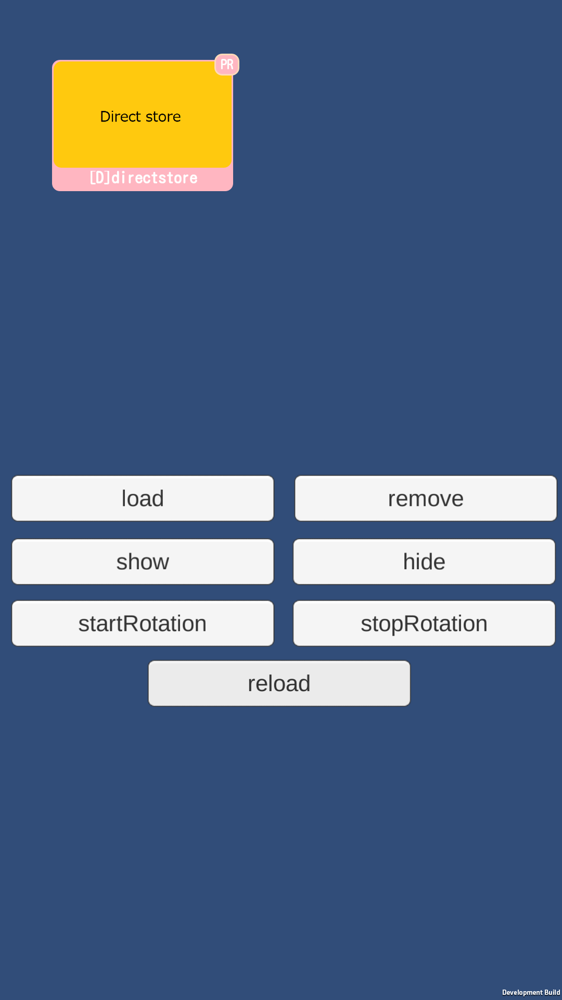
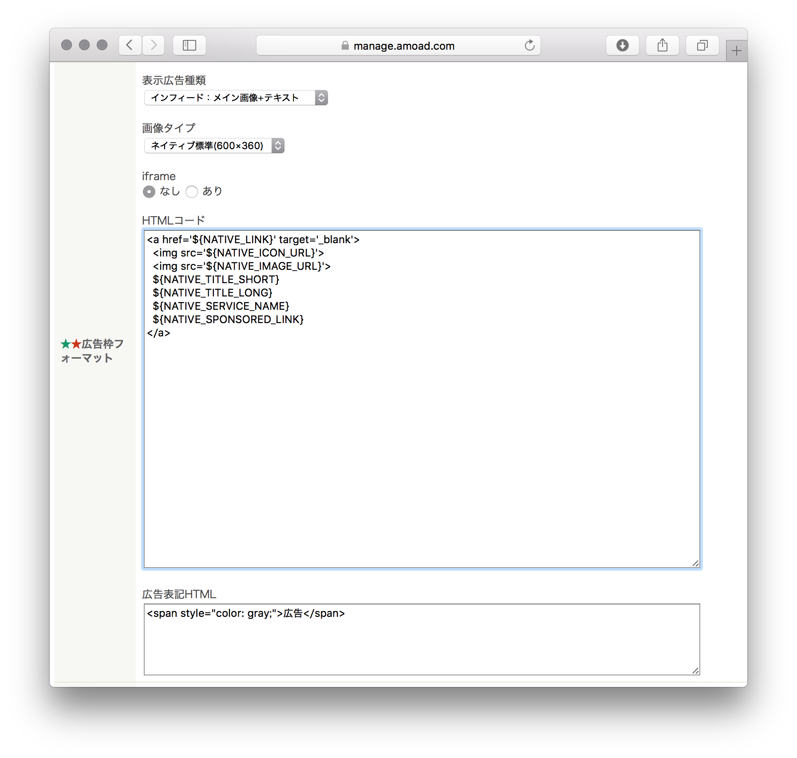
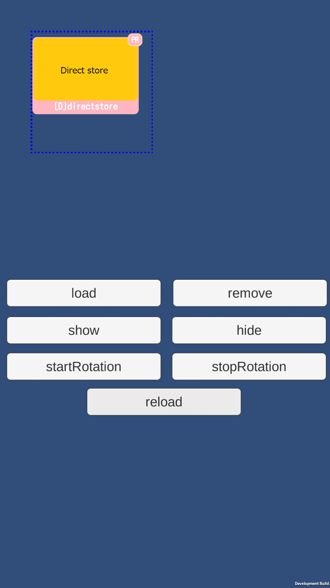
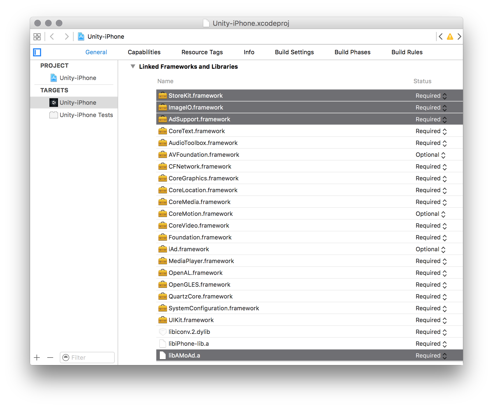
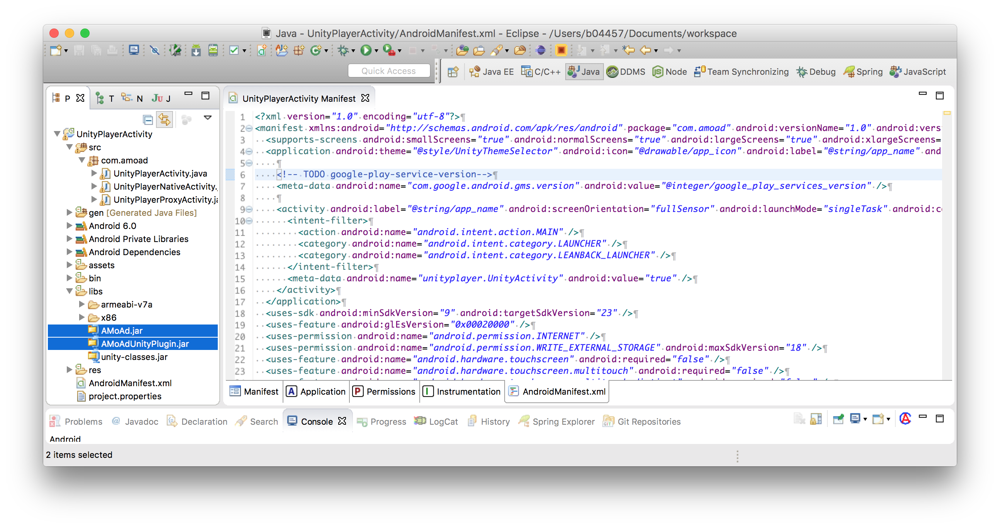

<div align="center">

</div>

# AMoAd Native Demo for Unity




## Introduction

ネイティブ広告のスタイルを管理画面よりHTML+CSSでデザインできます（HTMLコードの画面キャプチャは例です。実際にはアプリのデザインに合わせたコードを書きます）。

## Requirements

Unity4.x or later
>デモアプリはUnity5.3.1f1で動作確認ずみです。

## Installing

[ZIPをダウンロード](https://github.com/amoad/amoad-native-unity-sdk/archive/master.zip)

## Usage

管理画面から取得したsidをScripts/ClickHandler.csのSIDに設定する。tagは複数の広告を区別するための任意文字列です。

```cs
// [SDK] 管理画面から取得したsidを入力してください
private const string ad_sid = "62056d310111552c000000000000000000000000000000000000000000000000";
private const string ad_tag = "Ad01";
```

loadメソッドに以下のJSON文字列を渡すことで、広告の枠線を表示することができます。



```cs
AMoAdNativeUnityPlugin.Load(sid, tag, 100, 100, 400, 400,
  "{\"border\": \"dotted 2px #0000ff\"}");
```

## API

[AMoAd Native Unity API](AMoAdNativeUnityDemo/Assets/Plugins/AMoAdNativeUnityPlugin.cs)

## Project Settings

### iOS設定例

1. UnityでiOSプロジェックトをExportする。
2. 必要なFrameworkを追加する。
 - StoreKit.framework
 - ImageIO.framework
 - AdSupport.framework
3. libAMoAd.a が自動的に追加されていることを確認する。



### Android設定例

1. UnityでAndroidプロジェックトをExportする。
2. ExportされたAndroidプロジェックトでGooglePlayerServiceを設定する。
   ([GooglePlayerService設定方法](https://developers.google.com/android/guides/setup#add_google_play_services_to_your_project))


